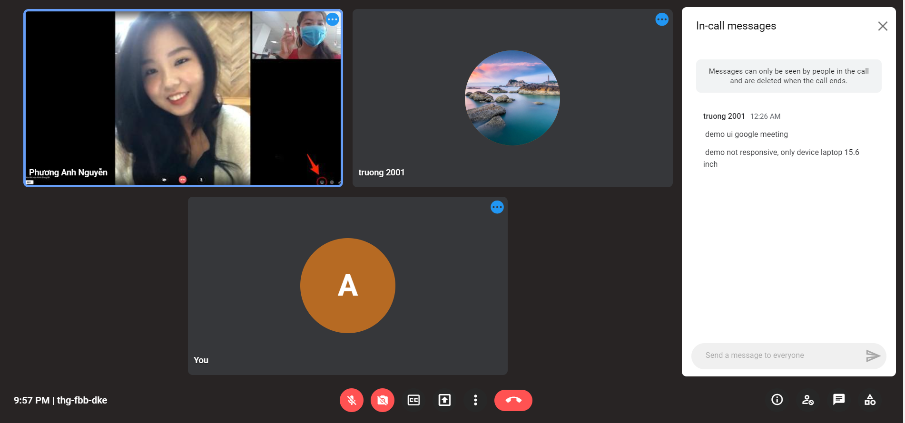

# view-meeting-ui

## Project setup
```
yarn install
```

### Compiles and hot-reloads for development
```
yarn serve
```

### Compiles and minifies for production
```
yarn build
```

### Lints and fixes files
```
yarn lint
```

### Demo

Test 1. Code Challenge

Sử dụng framework vuetify xây dựng UI cho trang web mô phỏng lại google meet như hình vẽ

[Link](https://interview-meeting-ui.vercel.app/)

